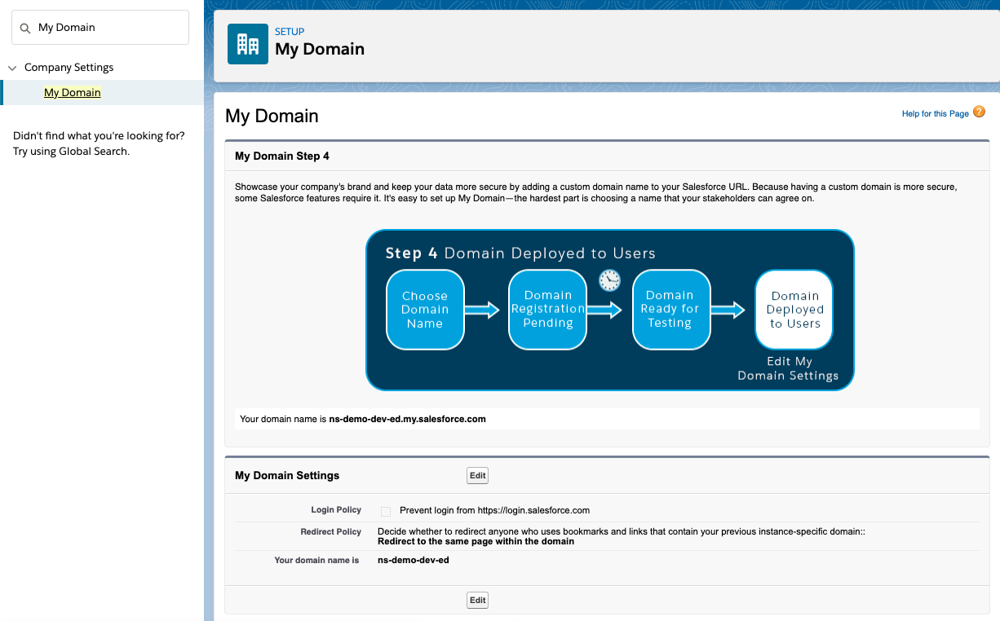
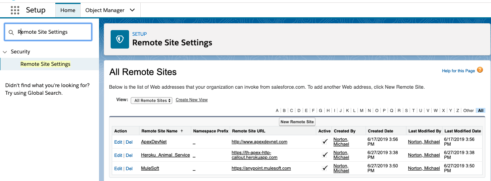
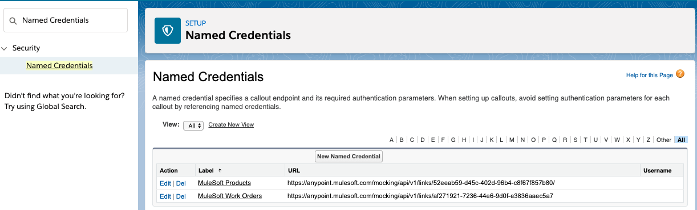

# Salesforce Setup for LWC and Integration

#### To use Lightning Web Components you must enable My Domain

#### Add your endpoint to the Remote Site Settings so that Apex can reach the endpoint

#### Add your endpoint (and credentials) to the Named Credentials so that Apex reference that for callouts

