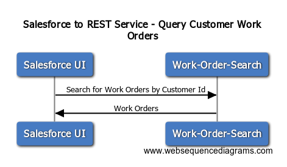

# Salesforce to REST Service 

## Overview

Calling the Work-Order-Service from Salesforce at a conceptual level




## Sequence Diagram Source
```
# Drop this into www.websequencediagrams.com

title Salesforce to REST Service - Query Customer Work Orders

Salesforce UI->Work-Order-Search: Search for Work Orders by Customer Id
Work-Order-Search->Salesforce UI: Work Orders
```

