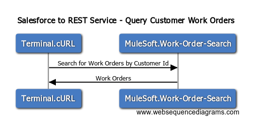
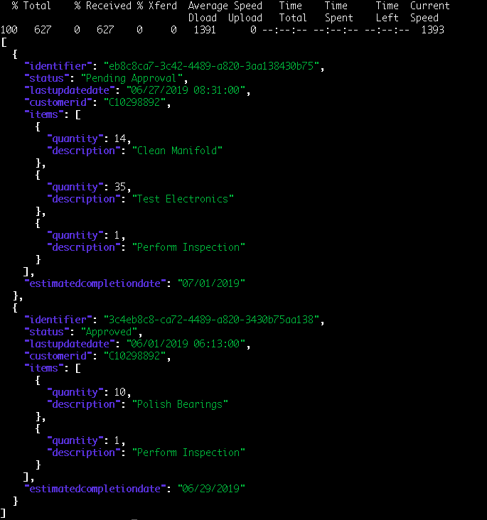

# cURL to REST Service  

## Overview

Calling the Work-Order-Service from cURL from your local machine



## Sequence Diagram Source
```
# Drop this into www.websequencediagrams.com

title Salesforce to REST Service - Query Customer Work Orders

Terminal.cURL->MuleSoft.Work-Order-Search: Search for Work Orders by Customer Id
MuleSoft.Work-Order-Search->Terminal.cURL: Work Orders
```

## Sample Code

Requires `jq` the JSON Query tool for results below

```
curl "https://anypoint.mulesoft.com/mocking/api/v1/links/af271921-7236-44e6-9d0f-e3836aaec5a7/customerworkorders/{customerId}" \
   -X POST | jq
```

