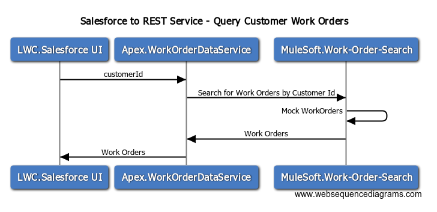

# Salesforce to REST Service - Query Customer Work Orders

## Overview

Calling the Work-Order-Service from Salesforce at a detailed level




## Sequence Diagram Source
```
# Drop this into www.websequencediagrams.com

title Salesforce to REST Service - Query Customer Work Orders

LWC.Salesforce UI->Apex.WorkOrderDataService: customerId
Apex.WorkOrderDataService->MuleSoft.Work-Order-Search: Search for Work Orders by Customer Id
MuleSoft.Work-Order-Search->MuleSoft.Work-Order-Search: Mock WorkOrders
MuleSoft.Work-Order-Search->Apex.WorkOrderDataService: Work Orders
Apex.WorkOrderDataService->LWC.Salesforce UI: Work Orders
```


