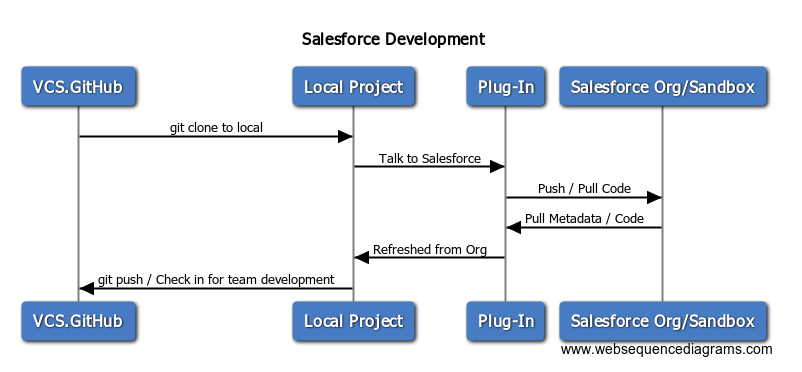

# Salesforce to REST Service - Query Customer Work Orders

## Overview

Calling the Work-Order-Service from Salesforce at a detailed level




## Sequence Diagram Source
```
# Drop this into www.websequencediagrams.com

title Salesforce Development

VCS.GitHub->Local Project: git clone to local
Local Project->Plug-In: Talk to Salesforce
Plug-In->Salesforce Org/Sandbox: Push / Pull Code
Salesforce Org/Sandbox->Plug-In: Pull Metadata / Code
Plug-In->Local Project: Refreshed from Org
Local Project->VCS.GitHub: git push / Check in for team development
```
